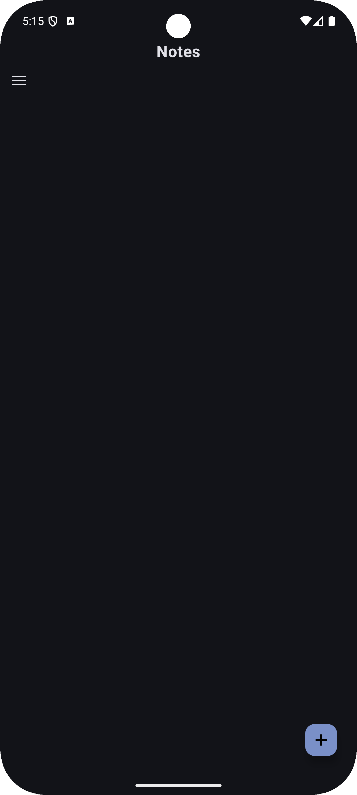
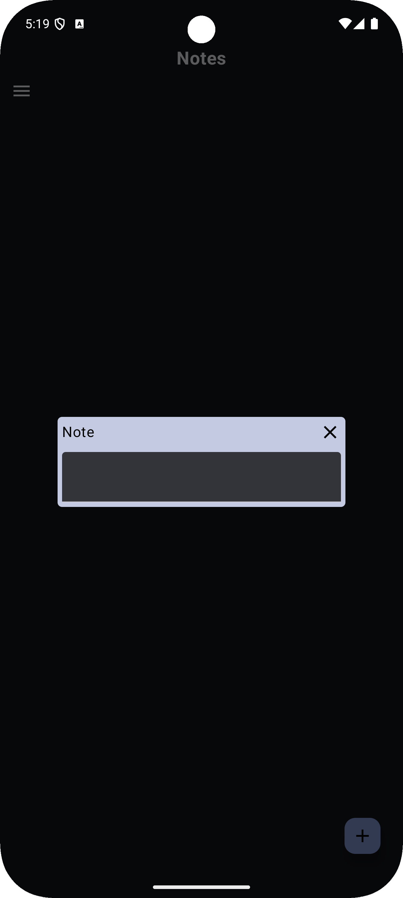
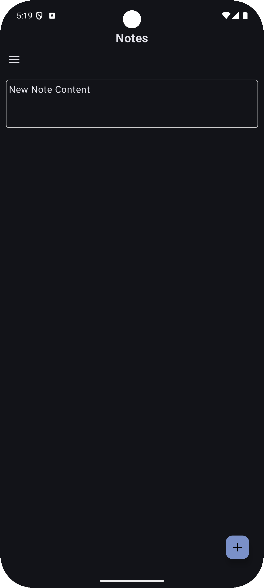
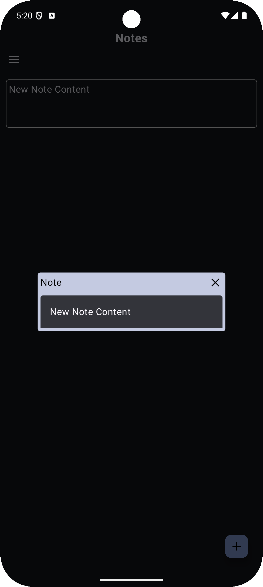
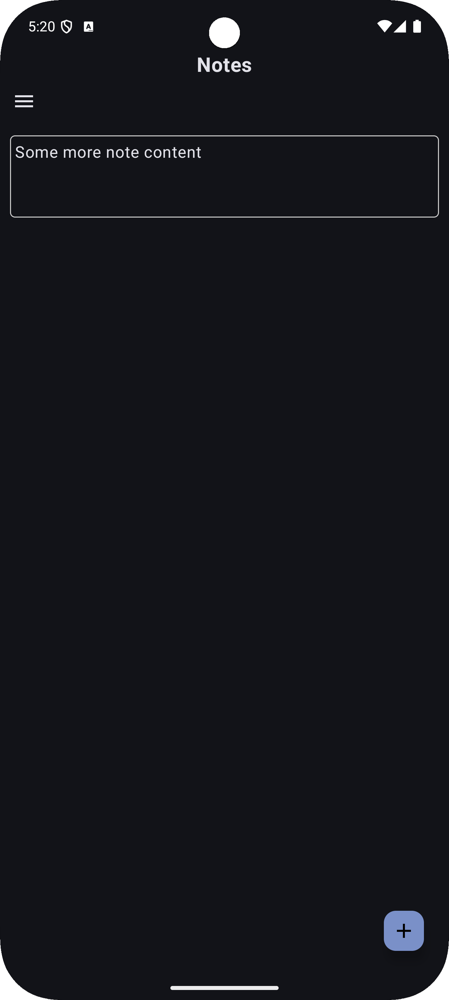

# NoteTaking
Simple Android note taking application, intuative and easy to use interface.

## Adding Notes
FAB (Floating Action Button) on main screen allows for the creation of new notes within the application.

    
    

## Editing Notes
On click handler for the note view creates dialog window for editing previous note content within the view.

    
    

# ToDos

## Main Application
- [ ] Sorting notes based on creation time
- [ ] Sorting notes based on last edited time
- [ ] Deleting notes
- [ ] Viewing deleted notes
- [ ] Restoring deleted notes

## Widget
- [ ] Selection of note to view